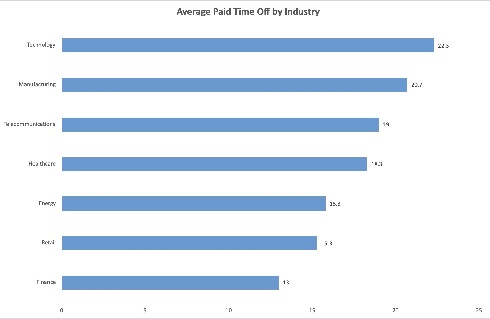
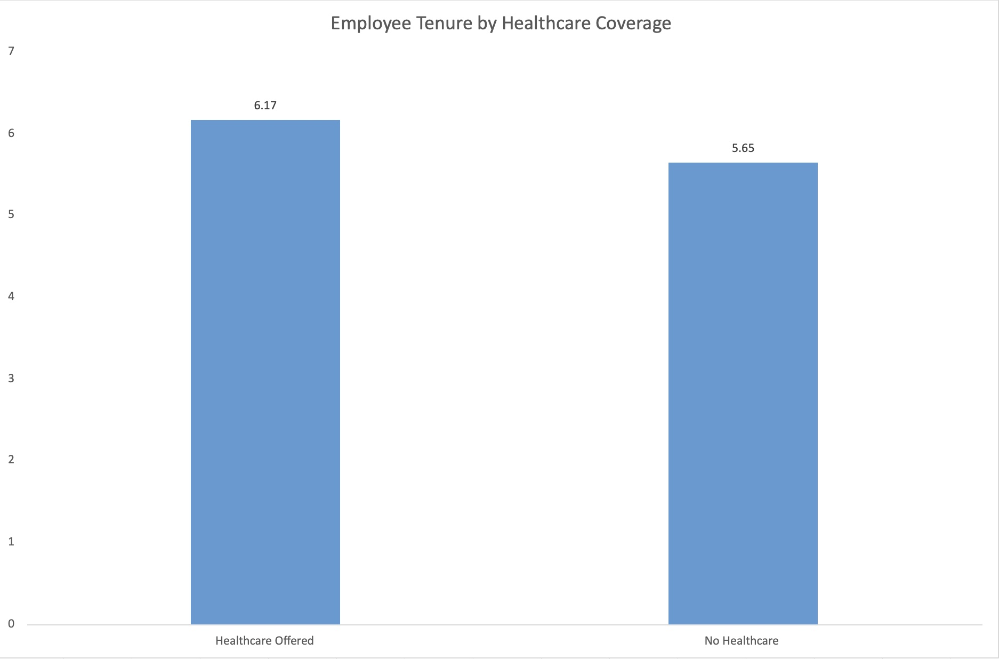
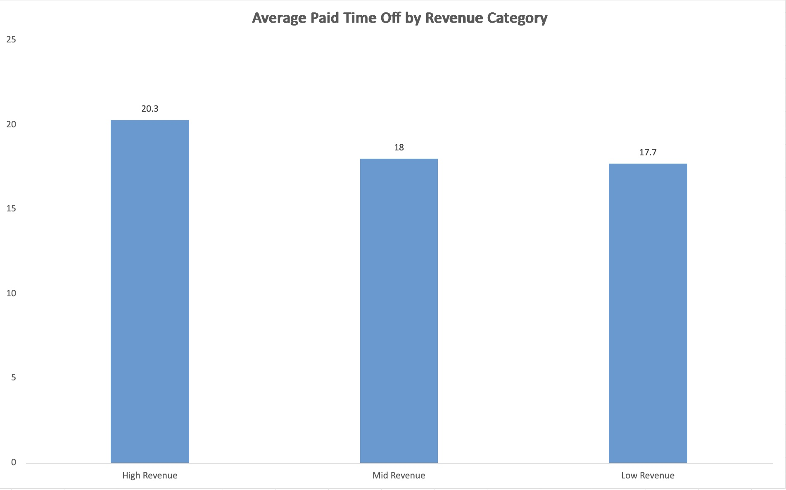

# Fortune 500 Employee Benefits Analysis | SQL Case Study

## Overview
This SQL case study analyzes employee benefits, workforce size, and retention trends across Fortune 500-style companies. Using PostgreSQL, the project explores how healthcare coverage, paid time off, maternity leave, company size, and revenue relate to employee tenure.

## Tools Used
- SQL
- PostgreSQL
- Excel

## Dataset Snapshot
- Simulated Fortune 500 company dataset
- Company-level data on revenue, workforce size, healthcare benefits, paid time off, maternity leave, and average employee tenure
- Used for company-level and industry-level analysis

## Key Findings
- Companies offering healthcare benefits showed slightly higher average employee tenure
- Technology and Healthcare companies offered the most competitive benefits packages in this dataset
- Larger companies tended to provide more paid time off and longer maternity leave
- Higher-revenue companies often offered stronger benefits overall

## Project Visuals

## Skills Demonstrated
SQL, aggregation, filtering, subqueries, window functions, data analysis, business analysis
